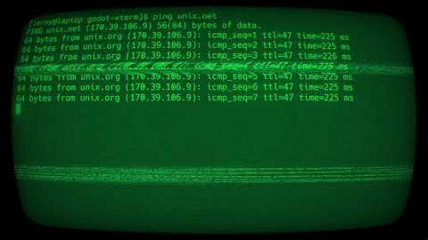

# GodotXterm - Terminal Emulator
 

GDNative terminal for Godot.
Built using [libtsm](https://www.freedesktop.org/wiki/Software/libtsm/), [libuv](https://github.com/libuv/libuv), and [node-pty](https://github.com/microsoft/node-pty).
Primarily developed and tested on Linux, it also supports macOS with partial support for Windows and HTML5. See the [Features section](#features) for more detail.

<video width="100%" controls>
  <source src="https://user-images.githubusercontent.com/3696783/126894061-a69eb6ad-9979-4723-ade7-829494a9fc87.mp4" />
</video>

https://user-images.githubusercontent.com/3696783/126894061-a69eb6ad-9979-4723-ade7-829494a9fc87.mp4

#### Table of Contents
1. [Features](#features)
2. [Screenshots](#screenshots)
3. [Demos and Examples](#demos-and-examples)
4. [Installation](#installation)
5. [Documentation](#documentation)
6. [License](#license)

## Features

- ### [Terminal](https://lihop.github.io/godot-xterm/api/terminal)
  A Terminal emulator Control node. 

  Supports ANSI and (some) XTerm Control Sequences which can be used to do things such as clear the screen, move the cursor, change printed text color, ring a bell, and so on.
  For an exhaustive list of terminal control sequences (not all of which are supported by GodotXterm) see ["XTerm Control Sequences"](https://invisible-island.net/xterm/ctlseqs/ctlseqs.html).

- ### [PTY](https://lihop.github.io/godot-xterm/api/pty)
  *Linux and macOS only.*

  Node for forking processes (e.g. bash, nodejs, python) with pseudoterminal file descriptors.
  Can be used with the Terminal node to get an actual shell.

  Not currently supported on Windows, but it could be in the future using [ConPTY](https://docs.microsoft.com/en-us/windows/console) or [WinPTY](https://github.com/rprichard/winpty).
  See issue [\#25](https://github.com/lihop/godot-xterm/issues/25).

- ### Terminal Editor Plugin
  *Linux and macOS only.*

  Adds a panel to the Editor's bottom panel that can be used to spawn terminals in the editor.
  Similar to VSCode's integrated terminal and IntelliJ's embedded terminal.

- ### Asciicast Import Plugin
  Adds support for importing asciinema v2 `.cast` files as animations that can be played by an AnimationPlayer that is a child of a Terminal node.
  Example `.cast` files can be downloaded from the [asciinema website](https://asciinema.org).

- ### Xresources Import Plugin
  Adds support for importing color schemes from `.xrdb` or `.Xresources` files.
  Example xresources files can be exported from [terminal.sexy](https://terminal.sexy).
  The [iTerm2-Color-Schemes repo](https://github.com/mbadolato/iTerm2-Color-Schemes) also has many example color scheme files in [xrdb](https://github.com/mbadolato/iTerm2-Color-Schemes/tree/master/xrdb) and [Xresources](https://github.com/mbadolato/iTerm2-Color-Schemes/tree/master/Xresources) format.

## Screenshots

|                                      |                                      |
|--------------------------------------|--------------------------------------|
|    | |
|||

## Demos and Examples

The GodotXterm repository contains several example scenes in the [`/examples`](https://github.com/lihop/godot-xterm/tree/stable/examples) directory.
After cloning this repo you will need to either build the GDNative binaries from source or copy pre-compiled binaries into your project.
See the [Setup section](https://lihop.github.io/godot-xterm/setup) for more details.

Other examples of GodotXterm usage are available online:

- [**Live Demo**](https://lihop.github.io/godot-xterm-dist/): An HTML5 export of the GodotXterm repo's example scenes.

- [**The Guest**](https://lihop.itch.io/the-guest): A Linux only submission to the [Linux Game Jam 2022](https://itch.io/jam/linux-game-jam-2022). Uses GodotXterm in conjunction with the [gdtemu addon](https://github.com/lihop/gdtemu) and Linux's Kernel-based Virtual Machine, to provide the player with interactive VM that can be used in the game world.

- [**Xterminate**](https://lihop.itch.io/xterminate): A Linux, macOS, and Windows demo which uses an older version GodotXterm in conjunction with [Godot Python](https://github.com/touilleMan/godot-python).

Are you using GodotXterm in your project and want it listed here? Please [open a pull request](https://github.com/lihop/godot-xterm/pulls) to have it added.

## Installation

GodotXterm is available on the [Godot Asset Library](https://godotengine.org/asset-library/asset/1007).
For more ways to install see the [Setup section](https://lihop.github.io/godot-xterm/setup).

## Documentation

Documentation is available on [GitHub Pages](https://lihop.github.io/godot-xterm).
If you have a question not answered by the docs, or would like more support, feel free to open a new discussion in the [discussions](https://github.com/lihop/godot-xterm/discussions) section of this project.

## License

Copyright (c) 2020-2022, Leroy Hopson and [contributors](https://github.com/lihop/godot-xterm/graphs/contributors) (MIT License).

See the [full license](https://github.com/lihop/godot-xterm/blob/stable/LICENSE.md).

### Third-party components

The GDNative source code incorporates code snippets and source code from many third-party libraries. The licenses of these components can be found in the various sub-directories of this project (provided git submodules have been cloned). Many of these licenses must be distributed with source and binary distributions of this software. For convenience, the texts of these licenses have been bundled together (but clearly demarcated) in the [THIRDPARTY_NOTICES.txt](https://github.com/lihop/godot-xterm/blob/stable/addons/godot_xterm/THIRDPARTY_NOTICES.txt) file.

**Note:** On platforms where the PTY node is not supported or if the library has been compiled with the option `disable_pty=yes` then only the licenses bundled in [THIRDPARTY_NOTICES_nopty.txt](https://github.com/lihop/godot-xterm/blob/stable/addons/godot_xterm/THIRDPARTY_NOTICES_nopty.txt) are applicable.

### Fonts

- The Hack regular font is bundled with GodotXterm as the default Terminal font. This is also the default monospace font of the Godot editor. See the [full license](https://github.com/lihop/godot-xterm/blob/stable/addons/godot_xterm/themes/fonts/hack/LICENSE.md).

### Nonbundled Resources
The following resources are not bundled with GodotXterm (i.e. are not included in the `addons/godot_xterm` directory) but are included in this repository for demo and testing purposes. They are:

#### Sounds

- [bell.wav](https://github.com/lihop/godot-xterm/blob/stable/themes/audio/bell.wav) by [InspectorJ](https://www.jshaw.co.uk), downloaded from [freesound.org](https://freesound.org/people/InspectorJ/sounds/484344/), released under [CC-BY-3.0](https://creativecommons.org/licenses/by/3.0/).

#### Fonts

- The **bold**, *italic*, and ***bold italic*** styles of the Hack font which are covered by the same license as above.
- Nerd Fonts. Combines symbols from a multitude of other fonts. See [license information](https://github.com/lihop/godot-xterm/blob/stable/themes/fonts/nerd_fonts/README.md).
- Noto Color Emoji. Released under the [SIL Open Font License](https://github.com/lihop/godot-xterm/blob/stable/themes/fonts/noto_color_emoji/LICENSE_OFL.txt).
- Unifont. Dual-licensed (since version 13.0.04) under the GNU GPL 2+ with the GNU font embedding exception and the SIL Open Font License (OFL) version 1.1. This project uses it under the terms of the [SIL Open Font License](https://github.com/lihop/godot-xterm/blob/stable/themes/fonts/unifont/LICENSE_OFL-1.1.txt).
